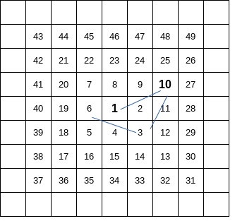
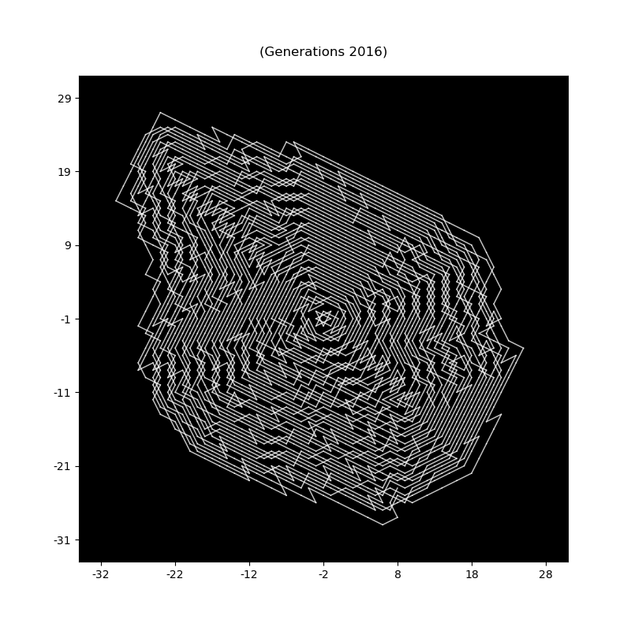
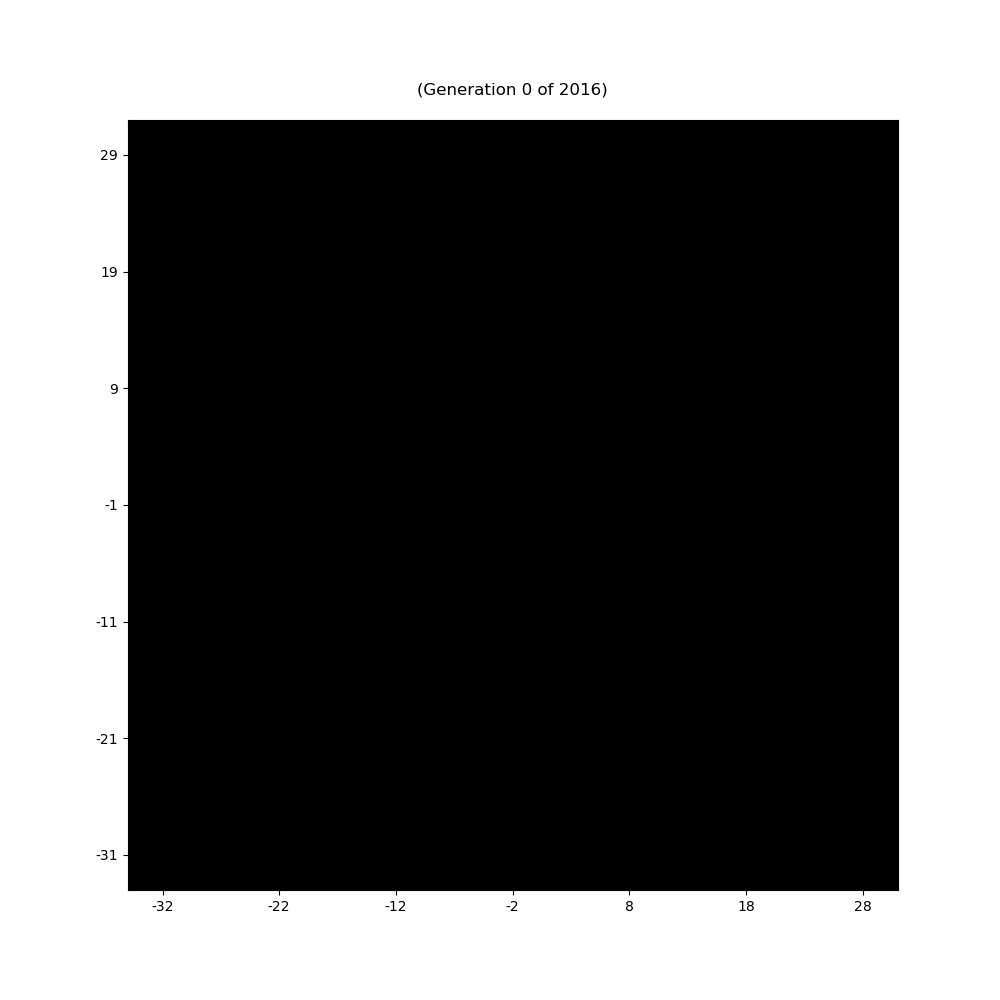

# The Trapped Knight Problem Solver

## Table of Contents
=================
* [The Problem](#the-problem)
  * [Examples](#examples)
* [The Python Libary](#the-python-library)
  * [Requirements](#requirements)
  * [Installation](#installation)
  * [The Classes](#the-classes)
    * [Class spiralBoard](#class-spiralboard)
    * [Class knightPathFinder](#class-knightpathfinder)
    * [Class pathAnimation](#class-pathanimation)
  * [Sample Usage](#sample-usage)
  * [The main file](#the-main-file)
* [Licence](#licence)
* [References](#references)

## The Problem

The trapped knight problem is the following:
  Think of an infinite chess board where the squares are labeled according to the following pattern:
  
  the squares are numbered along a spiral starting at one and circling around it until infnity.

  Next put a knight on the **1** square of this spiral chess board and ask for the path of the knight according to the following two rules
  1. never go to a square were the knight has been before
  2. Go to the square with minimum integer label. 

  In the situation above starting at the **1** the next square is **10**. 

This problem can be generalized to other types of knights, not only hopping in (1,2) steps on the board, but with arbitrary step patterns (x,y) (with x>0 and y>0). It is importantt to notice the problem can be simplified to the situtation where `gcd(x,y)==1`. In the case `gcd(x,y)==c>1` this can be simplified to the case `(x/c,y/c)` withput loss of  generality. Of course we also have the same resulty for the (y,x)-knight compared to the (x,y)-knight.

Questions are now? 
  1. How long is ths path? 
  2. Can it be infinite? 

For a (1,2)-knight the path has length 2016, for other types of knight we have the following sample data (computed using this library):

Type of knight | Length | xDiam | yDiam | Density
-------------- | ------ | ----- | ----- | -------
(1,2)-knight   | 2016   | 55    |  56   | 0.65455
(1,3)-knight   | 3723   | 92    |  91   | 0.44470
(1,4)-knight   | 13103  | 125   |  125  | 0.83859
(2,1)-knight   | 2016   | 55    |  56   | 0.65455
(2,3)-knight   | 4634   | 81    |  81   | 0.70629
(3,1)-knight   | 3723   | 92    |  91   | 0.44470
(3,2)-knight   | 4634   | 81    |  81   | 0.70629
...            | ...    | ...   |  ...  | ...
...            | ...    | ...   |  ...  | ...
(17,22)-knight | 27154  | 277   |  278  | 0.35262  
(17,23)-knight | 9051   | 230   |  220  | 0.19766 
(18,23)-knight | 27430  | 277   |  283  | 0.34991 
...            | ...    | ...   |  ...  | ...


The meaning of the values is

* `Length` is path length
* `xDiam` is the maximum diameter of the path in x-direction
* `yDiam` is the maximum diameter of the path in y-direction
* `Density` is the ratio `Length/(xDiam*yDiam)` which is always `<=1`. The density expresses the degreaa of foldedness of the path.

Up to now no (x,y)-knight is known with infinite path length

## Examples 

All examples are generated using this library (in fact using the main.py, see below).

* An [MP4](./samples/knightPath-1-22.mp4) for the (1,22)-knight
* A gif for the (1,2)-knight\
  
* A HTML file for the [(2,5)-knight](./samples/knightPath-2-5.html)
* more to come

# The Python Library

## Requirements
  The source is a Python 3 library using 
  * Numpy
  * Matplotlib
  * Ffmpeg
  * imagemagick 

## Installation

1. Download the the file [theTrappedKnight.py](./theTrappedKnight.py) from this repository
2. Copy it into your working directory. 
3. Done

## The Classes

### Class spiralBoard
  tbd

### Class knightPathFinder  
  tbd

### Class pathAnimation
  tbd

## Sample Usage 

* A basic example script using this library may look like this:

  ```Python
  #!/usr/bin/env python3
  # -*- coding: utf-8 -*-

  # Import the three classes
  from theTrappedKnight import spiralBoard, knightPathFinder, pathAnimation 
  
  # Generate a spiral board
  mySpiralBoard  = spiralBoard()
  
  # Together with x,y geometry pass the board to the 
  # knightPathFinder class (here for the (1,2)-knight)
  myKnightPathFinder  = knightPathFinder(sb.squares, [1,4])
  
  # Generate the spiral path of the Knight
  myKnightPathFinder.genHistory()
  # The genHitory() method has a rudimentary output of some data of the path.
  # In this case we will get the command line output 
  # "Knight path of shape (1,2) , Length = 2016 , xDiam = 55 , yDiam = 56 , Density = 0.65455"
   
  # Define a new pathAnimation Class passing a knightPathFinder instance to it
  myPathAnimation=pathAnimation(myKnightPathFinder)
  
  # Animate the Path
  myPathAnimation.animate(outputType="animgif", color="white", speed=100, outDir="out", type="scatter")
  ```
* We are done! The result is 
<p align="center"></p>

## The main file
  
  main.py is a reference implementation of the library and can be used to generate data and graphical representantions of the problem. We have
  ```
  Usage:
        Python main.py <num> <num>-... [screen|mp4|avi|animgif|gif|html|data] [line|scatter]
        or
        Python main.py <num>-<num> <num>-<num> [screen|mp4|avi|animgif|gif|html|data] [line|scatter]
  ```

# Further Thoughts
  tbd

# Licence

  [GPL v3.0](./LICENCE)

# References
  * The problem will be explained in detail at [Numberphile](https://www.youtube.com/watch?v=RGQe8waGJ4w)
  * On [OEIS](https://oeis.org/A323472) the length is computed for a large quantity of x,y-knights (aka x,y-leapers) 

